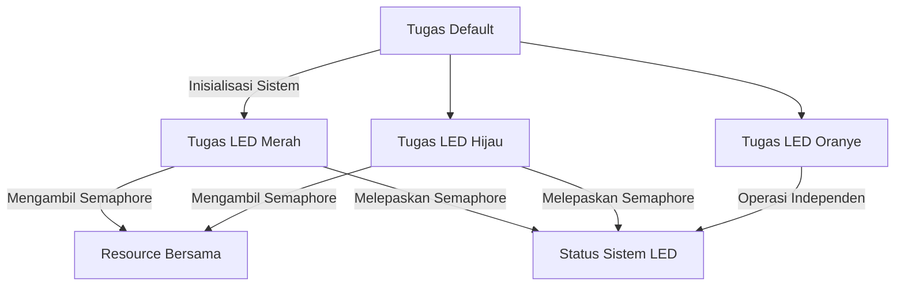

# Eliminasi Kontensi Resource Menggunakan Semaphore

## Gambaran Proyek

Proyek ini mendemonstrasikan cara mengelola kontensi resource dalam sistem multitasking menggunakan mekanisme semaphore. Dengan beralih dari menonaktifkan interupsi ke semaphore untuk melindungi bagian kode kritis, pendekatan ini meminimalkan gangguan runtime sambil secara efektif mengelola eksklusi mutual.

## Deskripsi Proyek

Fokus utama proyek ini adalah melindungi bagian kode kritis di mana beberapa tugas berbagi resource. Mekanisme semaphore diperkenalkan sebagai alternatif yang lebih efisien dibandingkan menonaktifkan interupsi, karena memberikan kontrol akses yang lebih terfokus tanpa mengganggu sistem secara keseluruhan. Implementasi dilakukan pada mikrokontroler STM32 menggunakan FreeRTOS.

## Tugas

### 1. **Tugas Default**
   - **Deskripsi**: Tugas dasar yang mensimulasikan aktivitas umum sistem.
   - **Prioritas**: Normal.
   - **Tujuan**: Sebagai tugas pengisi untuk memastikan scheduler sistem aktif.

### 2. **Tugas LED Merah**
   - **Deskripsi**: Menghidupkan/mematikan LED merah dan mengakses resource bersama menggunakan semaphore.
   - **Prioritas**: Normal.
   - **Langkah**:
     - Mengambil semaphore.
     - Mengakses resource bersama.
     - Melepaskan semaphore.

### 3. **Tugas LED Hijau**
   - **Deskripsi**: Menghidupkan/mematikan LED hijau dan mengakses resource bersama menggunakan semaphore.
   - **Prioritas**: Normal.
   - **Langkah**:
     - Mengambil semaphore.
     - Mengakses resource bersama.
     - Melepaskan semaphore.

### 4. **Tugas LED Oranye**
   - **Deskripsi**: Secara terus-menerus menghidupkan/mematikan LED oranye untuk menunjukkan aktivitas sistem.
   - **Prioritas**: Di atas Normal.

### 5. **Manajemen Bagian Kritis**
   - **Semaphore**: `CriticalResourceSemaphore` digunakan untuk melindungi resource bersama.
   - **Resource Kritis**: Data atau hardware yang memerlukan akses eksklusif.

## Hubungan Antar Tugas

- **Koordinasi Semaphore**: Tugas LED Merah dan Hijau berkoordinasi untuk mengakses resource bersama menggunakan semaphore. Hal ini memastikan eksklusi mutual dan mencegah kontensi resource.
- **Tugas Independen**: Tugas LED Oranye beroperasi secara independen, berfungsi sebagai indikator status sistem.

## Diagram Alur Kerja

## Dokumentasi

## Hasil Perilaku LED

1. **Tugas LED Merah**:
   - LED merah menyala selama 550ms saat mengakses resource bersama.
   - LED merah padam setelah selesai mengakses resource dan jeda selama 550ms.

2. **Tugas LED Hijau**:
   - LED hijau menyala selama 200ms saat mengakses resource bersama.
   - LED hijau padam setelah selesai mengakses resource dan jeda selama 200ms.

3. **Tugas LED Biru**:
   - LED biru menyala hanya jika terjadi kontensi resource (dua tugas mencoba mengakses resource bersamaan).
   - LED biru padam segera setelah resource bebas kembali.

4. **Tugas LED Oranye**:
   - LED oranye berkedip dengan interval 50ms untuk menunjukkan bahwa sistem berjalan normal.
